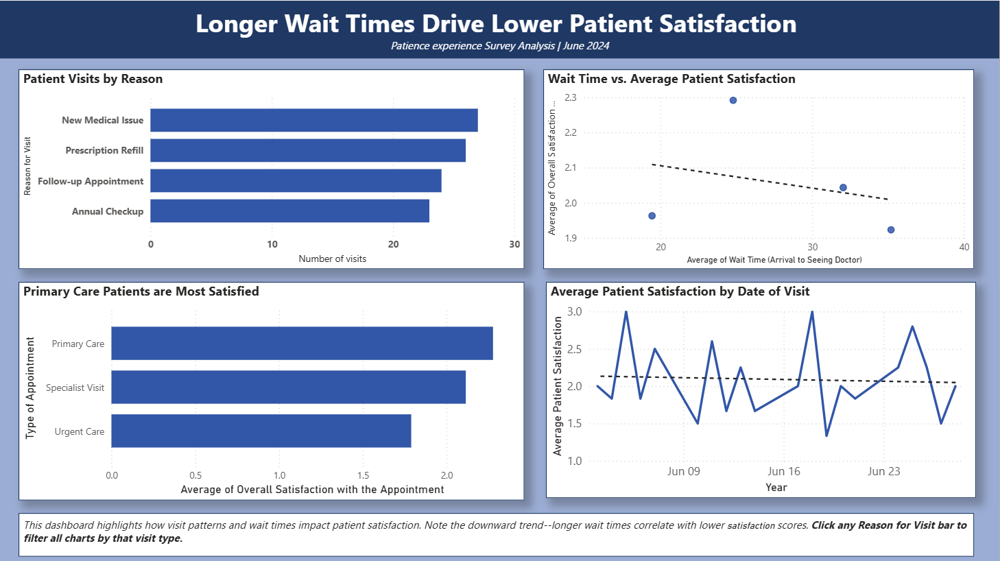

# Healthcare Data Visualization — Power BI

## Overview
Analyzed patient experience survey data from a medical 
practice serving 100 patients during June 2024. Created 
8 professional visualizations and 2 interactive dashboards 
to identify patterns in patient satisfaction and provide 
actionable, data-driven recommendations.

## Dashboard Preview

## Key Findings
- 40% of patients are uninsured — largest patient group
- Optimal wait time is ~25 minutes for peak satisfaction
- Urgent Care patients report lowest satisfaction scores
- Prescription refills have longest average wait times (~35 min)
- Patient satisfaction fluctuates significantly day-to-day

## Visualizations Created
- Bar Chart — Patient visits by reason
- Line Graph — Satisfaction trends over time
- Pie Chart — Patient distribution by insurance type
- Scatter Plot — Wait time vs. satisfaction correlation
- Tree Map — Satisfaction by appointment type
- Q&A Visuals — Three AI-generated insights

## Dashboard Panels
- **Panel 1:** Visit patterns and wait time impact on satisfaction
- **Panel 2:** Insurance type and demographics shaping experience

## Recommendations
1. Target ~25-minute optimal wait times
2. Automate prescription refill processes
3. Expand financial assistance for uninsured patients
4. Improve Urgent Care patient experience
5. Increase provider communication training

## Tools & Skills
- Microsoft Power BI Desktop & Service
- Data Visualization & Dashboard Design
- Data Storytelling — Good Charts principles
- Critical Thinking & Data Analysis
- Microsoft PowerPoint

## Files
- `Wilson_Patient_Experience_Analysis.pbix` — Power BI report
- `Wilson_Patient_Experience_Analysis.pptx` — Presentation

## Data Privacy Notice
Patient data is anonymized and provided for educational 
purposes only by University of Maryland Global Campus. 
Not for commercial use.

## References
- Berinato, S. (2016). Good Charts. Harvard Business Review Press.
- MIT Alumni. Best Practices for PowerPoint Presentations.
- Microsoft Power BI Documentation.
